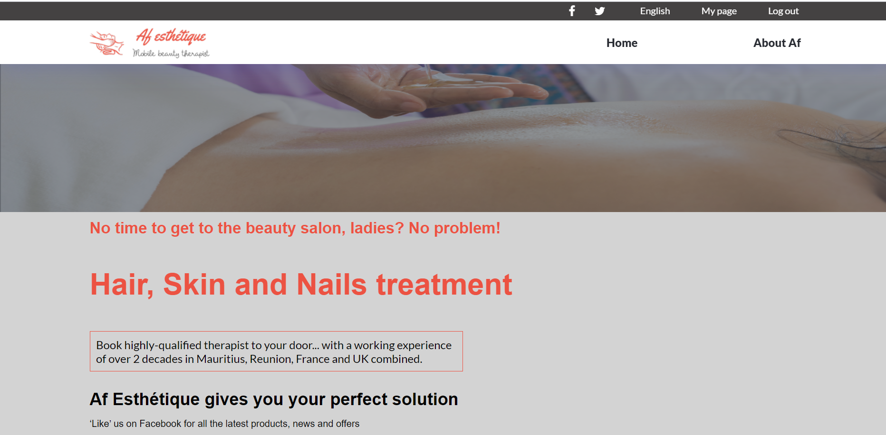

# beauty-therapist
This is a capstone project. It is about a mobile beauty and spa services for women. 

[Live Demo](https://akhtar-joomun.github.io/beauty-therapist/)

[Documentation](https://www.loom.com/share/480fb89af5b0497d871cb2f8d53faca5)

## Built With
- HTML
- CSS
- Javascript

## Getting Started
To get a local copy up and running follow these simple example steps.

- Clone this repository with: git clone `https://github.com/Akhtar-Joomun/beauty-therapist.git` using your terminal or command line.
- Change to the project directory by entering :  
  `cd beauty-therapist` in the terminal .

### Setup
Make sure the files are in the same folder.

## Authors

👤 **Akhtar Joomun**
- GitHub: [@githubhandle](https://github.com/Akhtar-Joomun)
- Twitter: [@twitterhandle](https://twitter.com/Akhtar54272024)
- LinkedIn: [LinkedIn](https://www.linkedin.com/in/akhtar-joomun-0b86021b8/)

## Acknowledgments
- Original idea designed by Cindy Shin in Behance.  Thanks to Cindy Shin, we have this amazing layout!
- Hat tip to anyone whose code was used
- Inspiration
- Figma for the design template

## 🤝 Contributing
Contributions, issues, and feature requests are welcome!
Feel free to check the [issues page](https://github.com/Akhtar-Joomun/beauty-therapist/issues/).

## Show your support
Give a ⭐️ if you like this project!

## :memo: License
This project is [MIT](https://choosealicense.com/licenses/mit/) licensed.
